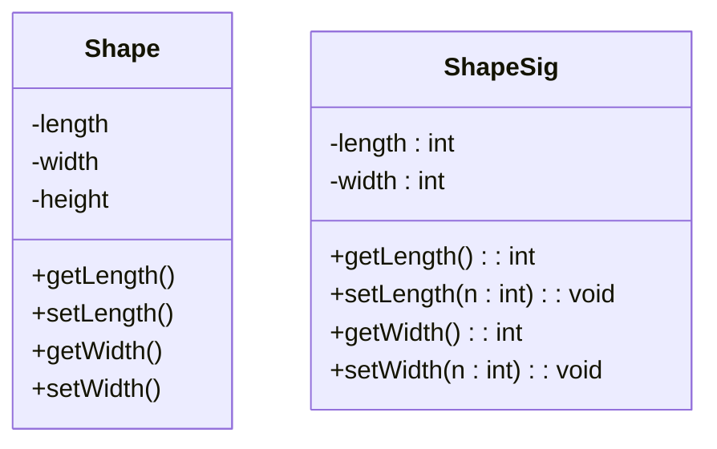
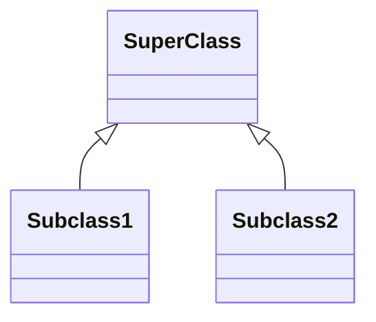

#sample UML diagrm for CSC102 by Kasandra Navrro  
#kasnavr@uat.edu

Create a diagram with 2 classes. Those classes need 3 attributes, 3 methods

Attributes come before properites or methods 
\+ public, \- private, \# protected 

